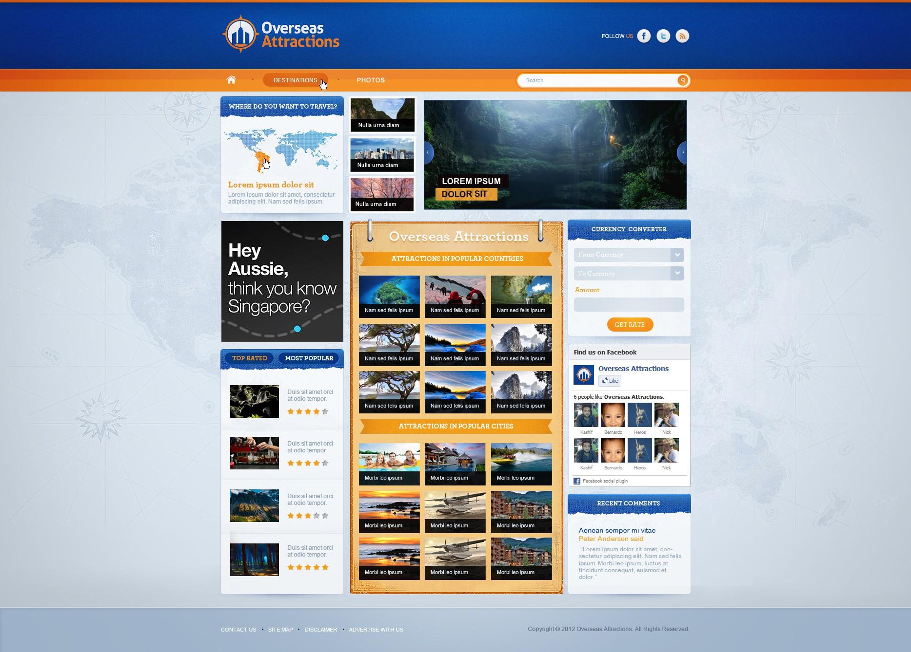
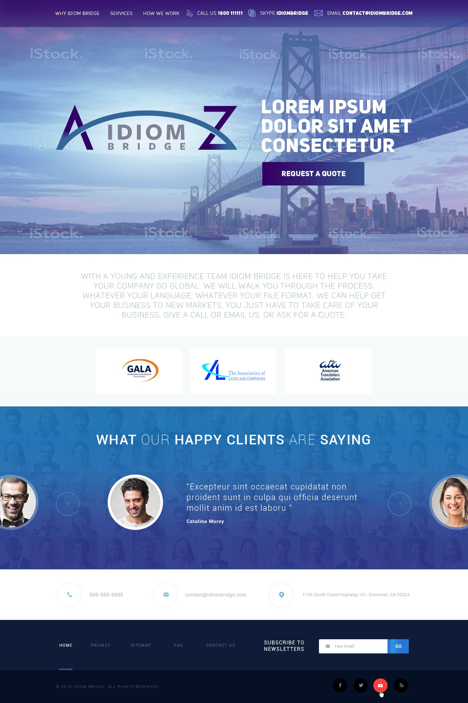
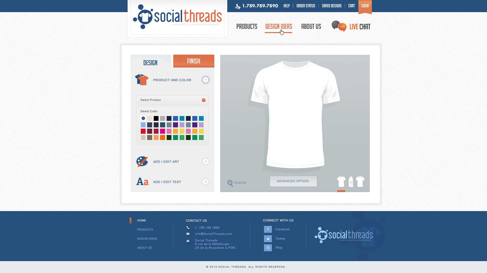
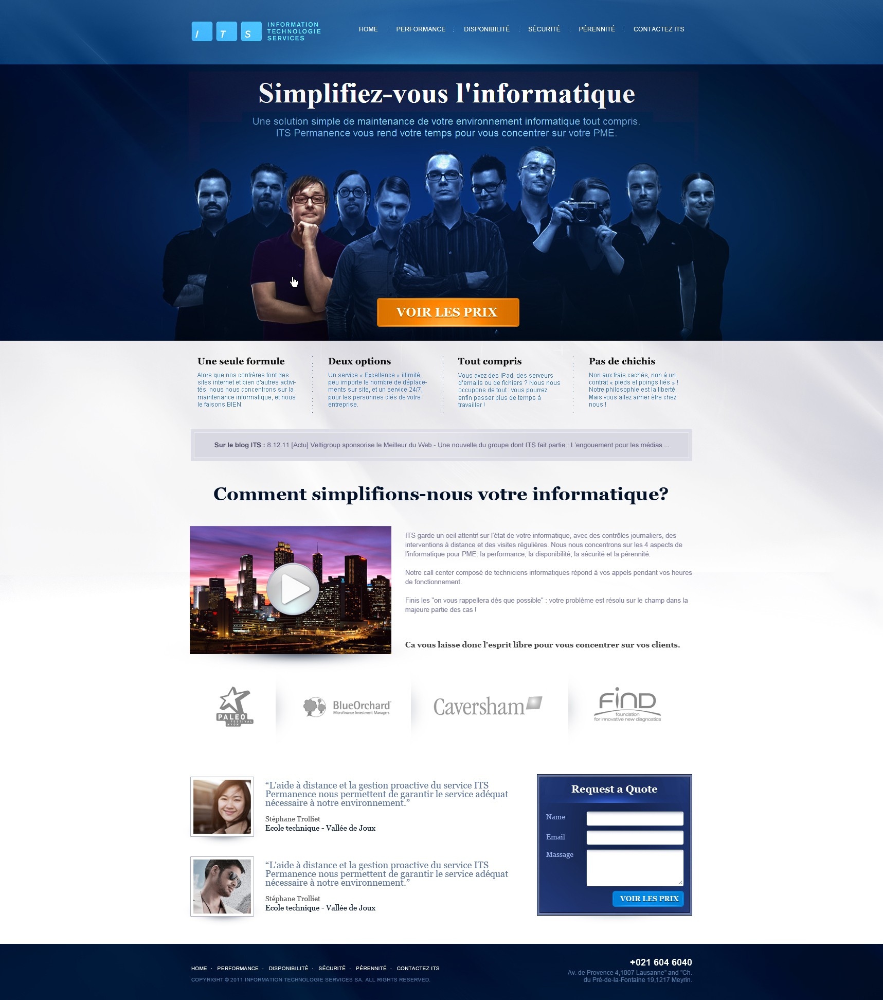
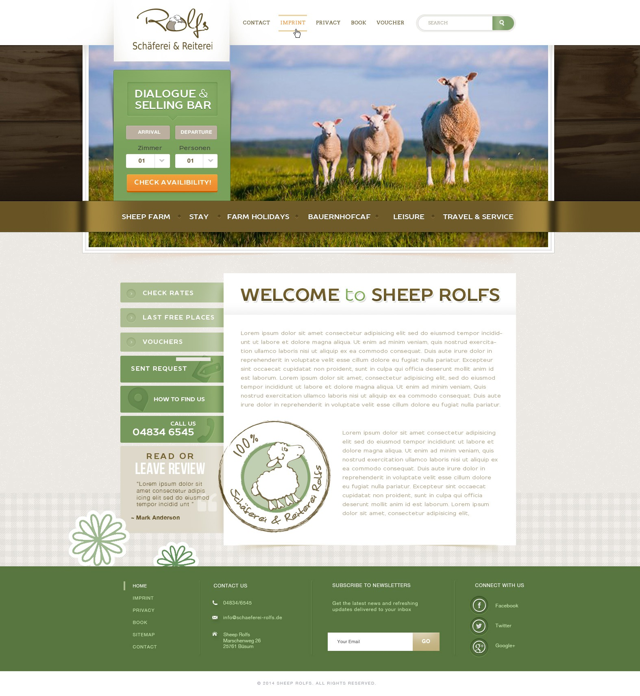

# Website Landing Page samples




## Description

This repository contains a responsive and visually appealing website landing page . The design is optimized for a modern user experience with smooth animations and a clean layout.

## Features

- Fully responsive design
- Smooth animations and transitions
- Clean and minimalistic layout
- Cross-browser compatibility

## Table of Contents

- [Installation](#installation)
- [Usage](#usage)
- [Screenshots](#screenshots)


## Installation

1. Clone the repository:
   ```bash
   git clone https://github.com/Nishanchaudhary/website-_landing_page.git
   ```
2. Navigate to the project directory:
   ```bash
   cd website-_landing_page
   ```

## Usage

This landing page can be used as a template for:

- Personal websites
- Company websites
- Product promotions

## Screenshots

### Website landing page Templates 





## Contact

If you have any questions, feel free to contact me:

- GitHub: [@Nishanchaudhary](https://github.com/Nishanchaudhary)

---

Enjoy using the landing page template!
